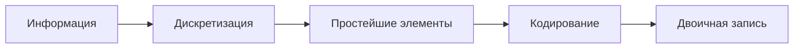

# ТЕОРИЯ

Задание 11 посвящено кодированию информации. Обычно в нём нужно понять, как кодируется один символ, сколько памяти занимает один объект и как по этим данным найти общий объём памяти или неизвестный параметр.

Чаще всего в таких задачах требуется определить:

- сколько бит требуется на один символ;
- сколько байт занимает один объект: пароль, номер, идентификатор;
- сколько памяти нужно для хранения нескольких объектов;
- либо, наоборот, какой параметр можно восстановить по известному объёму памяти.

Вся тема держится на двух простых идеях:

| Идея | Смысл |
|---|---|
| Любая информация хранится в двоичном виде | Компьютер работает с нулями и единицами |
| Объём данных зависит от способа кодирования | Чтобы найти память, нужно понять, как кодируется один элемент |

## Как информация превращается в двоичный код

Любая информация проходит два этапа.

| Этап | Что происходит | Примеры |
|---|---|---|
| Дискретизация | Информация разбивается на простейшие элементы | текст -> символы, изображение -> пиксели, звук -> отдельные измерения |
| Кодирование | Каждый элемент получает двоичную запись | символу, цвету или значению ставится в соответствие двоичный код |

Для текста таким правилом служит **кодировка**: таблица, в которой каждому символу соответствует двоичный код. Если символ есть в кодировке, его можно записать. Если символа в кодировке нет, сохранить его в таком виде нельзя.



## Равномерное кодирование

В задании 11 почти всегда используется **равномерное кодирование**.

Это значит, что каждому символу назначается свой код, все коды имеют **одинаковую длину**, а один символ всегда занимает одно и то же число бит.

| Что означает равномерность | Следствие |
|---|---|
| Все символы кодируются кодами одинаковой длины | Текст можно однозначно разбить на символы при чтении |
| Один символ всегда занимает фиксированное число бит | Объём текста считается простой формулой |

Если кодировка использует, например, `8` бит на символ, то любой символ занимает ровно `8` бит: буква, цифра, пробел или знак препинания.

## Что влияет на длину кода символа

Длина кода зависит от того, сколько разных символов должно поместиться в кодировку.

Сначала определяют состав алфавита, а потом подбирают минимальное число бит, которого хватит для всех символов.

| Что учитывать при подсчёте алфавита | Комментарий |
|---|---|
| Пробел | Это тоже символ |
| Цифры | Обычно это `10` символов: от `0` до `9` |
| Заглавные и строчные буквы | Считаются отдельно, если в условии они различаются |
| Специальные знаки | Каждый знак добавляет ещё одно значение в алфавит |
| Разные алфавиты | Латиница, кириллица и спецсимволы складываются в общий размер |

## Сколько символов кодируют `n` бит

Если на один символ отводится `n` бит, то можно закодировать `2^n` различных значений.

| Бит на символ | Число кодируемых значений |
|---|---:|
| `1` | `2` |
| `2` | `4` |
| `3` | `8` |
| `4` | `16` |
| `5` | `32` |
| `6` | `64` |
| `7` | `128` |
| `8` | `256` |
| `10` | `1024` |

Каждый новый бит вдвое увеличивает число возможных кодов.

## Как найти минимальное число бит на символ

Во всех стандартных задачах работает один и тот же алгоритм:

1. Посчитать количество символов в алфавите.
2. Найти минимальное `n`, для которого выполняется неравенство `2^n >= K`, где `K` — размер алфавита.
3. Это `n` и будет минимальным числом бит на один символ.

Коротко:

> Ищем первую степень двойки, которая не меньше количества символов.

## Алгоритм для большинства задач

| Шаг | Что делаем |
|---|---|
| 1 | Находим размер алфавита |
| 2 | Определяем число бит на один символ |
| 3 | Считаем размер одного объекта в битах |
| 4 | Переводим результат в байты и, если нужно, округляем вверх |
| 5 | Находим общий объём или неизвестный параметр по условию |

## Типовые примеры

| Алфавит | Число символов | Проверка | Ответ |
|---|---:|---|---:|
| Десятичные цифры | `10` | `2^3 = 8` мало, `2^4 = 16` хватает | `4` бита |
| Латинские буквы `A-Z` | `26` | `2^4 = 16` мало, `2^5 = 32` хватает | `5` бит |
| Кириллица в двух регистрах и цифры | `33 + 33 + 10 = 76` | `2^6 = 64` мало, `2^7 = 128` хватает | `7` бит |

## Как находить объём текстовой информации

Если известно, сколько бит занимает один символ и сколько символов содержит текст, то объём находится по формуле:

`I = k * i`

| Обозначение | Значение |
|---|---|
| `I` | объём информации |
| `k` | количество символов |
| `i` | число бит на один символ |

Полезные переводы:

| Единица | Равна |
|---|---|
| `1 байт` | `8 бит` |
| `1 Кбайт` | `1024 байта` |
| `1 Мбайт` | `1024 Кбайта` |

## Когда округлять вверх, а когда вниз

| Ситуация | Как округлять | Почему |
|---|---|---|
| Размер одного объекта в байтах | Вверх | Нельзя потерять часть данных |
| Размер поля, пароля, номера, идентификатора | Вверх | В памяти хранится целое число байт |
| Максимальное количество объектов, которое помещается в память | Вниз | Нельзя взять часть объекта |

Именно на этом шаге чаще всего и ошибаются.

## Что важно не забыть в задачах

| Что проверить | Почему это важно |
|---|---|
| Сначала найден алфавит, потом число бит | Без размера алфавита нельзя определить код |
| Учтены все символы | Часто забывают пробелы, регистр, специальные знаки |
| Результат переведён в байты | Многие задачи спрашивают ответ не в битах |
| Округление сделано в нужную сторону | Именно здесь чаще всего теряют балл |
| Не перепутан алфавит и длина сообщения | Это разные величины |

## Типичные ошибки

| Ошибка | Что должно быть |
|---|---|
| Не учли пробел или специальный знак | Каждый допустимый символ входит в алфавит |
| Слили заглавные и строчные буквы | Если регистр различается, это разные символы |
| Взяли степень двойки на глаз | Нужно проверить предыдущую степень |
| Перепутали количество символов и длину текста | Это разные параметры |
| Посчитали в битах, а ответ нужен в байтах | Всегда проверяйте единицы измерения |
| Округлили размер объекта вниз | Так теряется часть информации |

## Короткая шпаргалка

| Что нужно помнить | Формула или правило |
|---|---|
| Число значений, кодируемых `n` битами | `2^n` |
| Минимальное число бит на символ | первое `n`, для которого `2^n >= K` |
| Объём сообщения в битах | `I = k * i` |
| Перевод в байты | делим на `8` |
| Размер объекта в байтах | округляем вверх |
| Максимальное число объектов | берём целую часть вниз |

# РАЗБОР ПРОТОТИПОВ

## Прототип 1. Определение размера паролей

**Текст задания**

При регистрации в компьютерной системе каждому пользователю выдаётся пароль, состоящий из 15 символов и содержащий только символы из набора `И, Н, Ф, О, Р, М, А, Т, К`. Каждый такой пароль в компьютерной программе записывается минимально возможным и одинаковым целым количеством байт. При этом используют посимвольное кодирование, и все символы кодируются одинаковым и минимально возможным количеством бит. Определите объём памяти в байтах, отводимый этой программой для записи 25 паролей.

**Идея решения**

Задачу удобно решить двумя способами:

- вручную, последовательно считая размер кодировки, размер одного пароля и общий объём памяти;
- программно, выполняя те же шаги через Python.

Ключевой момент в обоих способах один и тот же: при переводе из битов в байты нужно округлять **в большую сторону**, потому что пароль хранится целым числом байт и часть информации отбросить нельзя.

**Ручное решение**

Сначала определим размер алфавита. В наборе `И, Н, Ф, О, Р, М, А, Т, К` содержится `9` символов.

Нужно найти минимальное количество бит, которого хватит для кодирования `9` символов:

- `2^3 = 8` — мало;
- `2^4 = 16` — хватает.

Значит, на один символ требуется `4` бита.

Теперь найдём размер одного пароля. В пароле `15` символов, значит:

`15 * 4 = 60 бит`.

Переведём это количество в байты:

`60 / 8 = 7.5 байта`.

По условию пароль записывается целым числом байт. Округлять вниз нельзя, потому что тогда часть данных не поместится в память. Поэтому берём ближайшее большее целое:

`8 байт` на один пароль.

Теперь найдём объём памяти для `25` паролей:

`25 * 8 = 200 байт`.

**Программное решение**

```python
from math import ceil, log2

alf = 9
bit = ceil(log2(alf))

sim = 15
bait = ceil(sim * bit / 8)

kol = 25
otv = bait * kol

print(otv)
```

**Разбор программного решения**

В этой программе используются две функции из модуля `math`:

- `log2()` вычисляет двоичный логарифм и помогает определить, сколько бит нужно на один символ;
- `ceil()` округляет число вверх.

Переменная `alf` хранит количество символов в алфавите.  
Переменная `bit` — минимальное число бит на один символ.  
Переменная `sim` — длина пароля в символах.  
Переменная `bait` — размер одного пароля в байтах.  
Переменная `kol` — количество паролей.  
Переменная `otv` — итоговый ответ.

Программа повторяет ручное решение:

- сначала находит число бит на символ;
- потом считает размер одного пароля;
- затем округляет результат до целого числа байт;
- после этого умножает на количество паролей.

**Ответ**

```text
200
```

## Прототип 2. Определение размера дополнительных сведений

**Текст задания**

Для регистрации на сайте необходимо придумать пароль, состоящий из 10 символов. Он должен содержать цифры, а также строчные или заглавные буквы латинского алфавита. В базе данных для хранения сведений о каждом пользователе отведено одинаковое и минимально возможное целое число байт. При этом используют посимвольное кодирование паролей, все символы кодируют одинаковым и минимально возможным количеством бит. Кроме собственного пароля, для каждого пользователя в системе хранятся дополнительные сведения, для чего выделено одинаковое целое число байт. Для хранения сведений о 30 пользователях потребовалось 870 байт. Сколько байт выделено для хранения дополнительных сведений об одном пользователе?

**Идея решения**

Задача решается в четыре шага:

1. найти размер алфавита и определить число бит на один символ;
2. вычислить размер пароля;
3. найти, сколько байт в среднем выделено на одного пользователя;
4. вычесть из этого объёма размер пароля.

Как и в предыдущем прототипе, при переводе из битов в байты нужно округлять результат вверх.

**Ручное решение**

Сначала найдём размер алфавита. Пароль может содержать:

- `10` цифр;
- `26` строчных латинских букв;
- `26` заглавных латинских букв.

Всего:

`10 + 26 + 26 = 62` символа.

Теперь найдём минимальное число бит на один символ:

- `2^5 = 32` — мало;
- `2^6 = 64` — хватает.

Значит, один символ кодируется `6` битами.

Пароль состоит из `10` символов, поэтому его длина равна:

`10 * 6 = 60 бит`.

Переведём это в байты:

`60 / 8 = 7.5 байта`.

По условию на пароль отводится целое число байт, значит, округляем вверх:

`8 байт` занимает один пароль.

Теперь найдём, сколько байт приходится на одного пользователя:

`870 / 30 = 29 байт`.

Из этих `29` байт:

- `8` байт занимает пароль;
- остальное занимают дополнительные сведения.

Значит, размер дополнительных сведений:

`29 - 8 = 21 байт`.

**Программное решение**

```python
from math import ceil, log2

alf = 10 + 26 + 26
bit = ceil(log2(alf))

sim = 10
par = ceil(sim * bit / 8)

uz = 870 / 30
dop = uz - par

print(int(dop))
```

**Разбор программного решения**

Здесь используются те же функции, что и в предыдущем прототипе:

- `log2()` помогает найти минимальное число бит на символ;
- `ceil()` округляет число вверх.

Переменная `alf` хранит размер алфавита.  
Переменная `bit` — количество бит на один символ.  
Переменная `sim` — длина пароля в символах.  
Переменная `par` — размер пароля в байтах.  
Переменная `uz` — объём памяти на одного пользователя.  
Переменная `dop` — размер дополнительных сведений.

Программа последовательно повторяет ручное решение:

- считает размер алфавита;
- находит число бит на символ;
- вычисляет размер пароля в байтах;
- делит общий объём памяти на число пользователей;
- вычитает из памяти на одного пользователя размер пароля.

В этой задаче значение `870 / 30` получается целым, поэтому после вычислений достаточно вывести результат как целое число.

**Ответ**

```text
21
```

## Прототип 3. Определение размера идентификаторов

**Текст задания**

При регистрации в компьютерной системе каждому пользователю выдаётся идентификатор из 101 символа, каждый из которых может быть десятичной цифрой или одним из 4090 символов специального набора. Каждый символ кодируется одинаковым и минимально возможным количеством бит. Идентификатор записывается в памяти с помощью минимально возможного целого количества байт. Сколько килобайт потребуется для хранения идентификаторов 2048 пользователей?

**Идея решения**

Схема решения остаётся той же:

1. определить размер алфавита;
2. найти число бит на один символ;
3. вычислить размер одного идентификатора в байтах;
4. умножить на число пользователей;
5. перевести результат в килобайты.

Главная тонкость этой задачи в том, что `2^12 = 4096` всё ещё недостаточно для `4100` символов, поэтому приходится брать `13` бит на символ.

**Ручное решение**

Сначала найдём размер алфавита. Для записи одного символа идентификатора можно использовать:

- `10` цифр;
- `4090` специальных символов.

Всего:

`10 + 4090 = 4100` символов.

Теперь найдём минимальное число бит на один символ:

- `2^12 = 4096` — мало;
- `2^13 = 8192` — хватает.

Значит, один символ кодируется `13` битами.

Идентификатор состоит из `101` символа, поэтому его размер в битах:

`101 * 13 = 1313 бит`.

Переведём в байты:

`1313 / 8 = 164.125 байта`.

Идентификатор хранится целым числом байт, значит, округляем вверх:

`165 байт` на один идентификатор.

Теперь найдём объём памяти для `2048` пользователей:

`165 * 2048 = 337920 байт`.

По условию ответ нужно дать в килобайтах. Переведём:

`337920 / 1024 = 330 Кбайт`.

**Программное решение**

```python
from math import ceil, log2

alf = 10 + 4090
bit = ceil(log2(alf))

sim = 101
idn = ceil(sim * bit / 8)

kol = 2048
otv = kol * idn / 1024

print(int(otv))
```

**Разбор программного решения**

В программе:

- `alf` — размер алфавита;
- `bit` — число бит на один символ;
- `sim` — длина идентификатора;
- `idn` — размер одного идентификатора в байтах;
- `kol` — количество пользователей;
- `otv` — итоговый объём в килобайтах.

Функция `log2()` помогает определить минимальное количество бит на символ, а `ceil()` используется для округления вверх при переводе размера идентификатора в байты.

Программа повторяет ручное решение:

- сначала считает размер алфавита;
- затем находит число бит на один символ;
- после этого вычисляет размер одного идентификатора в байтах;
- умножает его на число пользователей;
- переводит результат из байтов в килобайты.

**Ответ**

```text
330
```

## Прототип 4. Наибольшее количество пользователей

**Текст задания**

При регистрации в компьютерной системе каждому пользователю выдаётся пароль, состоящий из 7 символов. В качестве символов используют прописные и строчные буквы латинского алфавита. В базе данных для хранения сведений о каждом пользователе отведено одинаковое и минимально возможное целое число байт. При этом используют посимвольное кодирование паролей, все символы кодируют одинаковым и минимально возможным количеством бит. Кроме собственного пароля, для каждого пользователя в системе хранятся дополнительные сведения, для чего выделено 12 байт на одного пользователя. В компьютерной системе выделено 2 Кбайт для хранения сведений о пользователях. О каком наибольшем количестве пользователей может быть сохранена информация в системе?

**Идея решения**

Сначала нужно найти размер пароля, потом размер информации об одном пользователе, а затем понять, сколько таких пользователей помещается в заданный объём памяти.

В этой задаче важно не округлять результат деления вверх. После деления общего объёма памяти на размер одного пользователя нужно взять только целое число пользователей, которое точно помещается в память.

**Ручное решение**

Сначала найдём размер алфавита. Используются:

- `26` строчных латинских букв;
- `26` заглавных латинских букв.

Всего:

`26 + 26 = 52` символа.

Найдём минимальное число бит на один символ:

- `2^5 = 32` — мало;
- `2^6 = 64` — хватает.

Значит, один символ кодируется `6` битами.

Пароль состоит из `7` символов, поэтому его размер:

`7 * 6 = 42 бита`.

Переведём в байты:

`42 / 8 = 5.25 байта`.

Пароль хранится целым числом байт, значит, округляем вверх:

`6 байт` на один пароль.

Кроме пароля, на каждого пользователя выделено ещё `12 байт` дополнительных сведений. Тогда один пользователь занимает:

`6 + 12 = 18 байт`.

Теперь переведём общий объём памяти в байты:

`2 Кбайт = 2 * 1024 = 2048 байт`.

Найдём, сколько пользователей помещается в эту память:

`2048 / 18 = 113.7...`

Но хранить можно только целое число пользователей. Значит, максимально помещается:

`113` пользователей.

Если взять `114` пользователей, потребуется:

`114 * 18 = 2052 байта`,

а это уже больше `2048` байт.

**Программное решение**

```python
from math import ceil, log2

alf = 26 + 26
bit = ceil(log2(alf))

sim = 7
par = ceil(sim * bit / 8)

uz = par + 12

for kol in range(1, 1000):
    if kol * uz <= 2 * 1024:
        print(kol)
```

**Разбор программного решения**

В этой программе:

- `alf` — размер алфавита;
- `bit` — число бит на один символ;
- `sim` — длина пароля;
- `par` — размер пароля в байтах;
- `uz` — объём памяти на одного пользователя;
- `kol` — количество пользователей, которое перебирается в цикле.

Сначала программа находит размер одного пользователя так же, как в ручном решении. После этого используется цикл `for`, который перебирает разные значения `kol`.

Проверка

`kol * uz <= 2 * 1024`

означает: помещается ли информация о таком количестве пользователей в `2 Кбайт`.

Программа выводит все подходящие значения `kol`. Последнее выведенное число и будет максимальным количеством пользователей, которое не превышает ограничение.

Такой способ особенно удобен в задачах, где нужно не просто вычислить величину по формуле, а проверить, какие значения удовлетворяют условию.

**Ответ**

```text
113
```

## Прототип 5. Максимальная длина номера

**Текст задания**

На предприятии каждой изготовленной детали присваивают серийный номер, содержащий десятичные цифры, 52 латинские буквы с учётом регистра и символы из 1988-символьного специального алфавита. В базе данных для хранения каждого серийного номера отведено одинаковое и минимально возможное число байт. При этом используют посимвольное кодирование серийных номеров, все символы кодируют одинаковым и минимально возможным числом бит. Известно, что для хранения 1974 серийных номеров отведено не более 579 Кбайт памяти. Определите максимально возможную длину серийного номера.

**Идея решения**

Нужно найти:

1. сколько бит занимает один символ;
2. сколько байт может занимать один номер при заданном ограничении;
3. какая максимальная длина номера укладывается в это ограничение.

Главная трудность этой задачи связана с округлением до целого числа байт. Из-за него недостаточно просто поделить общий объём на число символов: нужно ещё проверить соседнее значение длины.

**Ручное решение**

Сначала найдём размер алфавита. Для записи одного символа номера используются:

- `10` цифр;
- `52` латинские буквы;
- `1988` специальных символов.

Всего:

`10 + 52 + 1988 = 2050` символов.

Теперь найдём минимальное число бит на один символ:

- `2^11 = 2048` — мало;
- `2^12 = 4096` — хватает.

Значит, один символ кодируется `12` битами.

Пусть длина номера равна `x` символов. Тогда один номер занимает:

`x * 12 бит`.

По условию для `1974` номеров отведено не более `579 Кбайт`. Переведём это в байты:

`579 * 1024 = 592896 байт`.

Теперь найдём, сколько байт может приходиться не более чем на один номер:

`592896 / 1974 = 300.35...`

Значит, один номер может занимать не более `300` полных байт.

Переведём это ограничение в биты:

`300 * 8 = 2400 бит`.

Так как один символ занимает `12` бит, получаем:

`2400 / 12 = 200 символов`.

Теперь нужно проверить следующее значение, потому что в задаче есть округление до целого числа байт.

Если взять `201` символ, то один номер будет занимать:

`201 * 12 = 2412 бит`.

Переведём в байты:

`2412 / 8 = 301.5 байта`.

После округления вверх получаем:

`302 байта` на один номер.

Тогда для `1974` номеров потребуется:

`1974 * 302 = 596148 байт`.

Переведём в килобайты:

`596148 / 1024 = 582.17... Кбайт`.

Это больше `579 Кбайт`, значит, `201` символ уже не подходит.

Следовательно, максимальная длина серийного номера равна `200`.

**Программное решение**

```python
from math import ceil, log2

alf = 10 + 52 + 1988
bit = ceil(log2(alf))

for dl in range(1, 1000):
    nom = ceil(dl * bit / 8)
    if 1974 * nom <= 579 * 1024:
        print(dl)
```

**Разбор программного решения**

В этой программе:

- `alf` — размер алфавита;
- `bit` — число бит на один символ;
- `dl` — длина номера, которую перебирает цикл;
- `nom` — размер одного номера в байтах.

Сначала программа находит размер алфавита и число бит на один символ. Затем цикл перебирает разные значения длины номера.

Для каждого `dl` вычисляется размер одного номера:

`ceil(dl * bit / 8)`

Здесь `ceil()` особенно важен, потому что номер хранится целым числом байт.

После этого проверяется условие:

`1974 * nom <= 579 * 1024`

Оно означает, что суммарный размер всех номеров не превышает допустимый объём памяти.

Программа выводит все подходящие длины, и последнее выведенное значение будет максимальным допустимым ответом.

**Ответ**

```text
200
```

## Прототип 6. Минимальная мощность алфавита

**Текст задания**

На предприятии каждой изготовленной детали присваивают серийный номер, состоящий из 1231 символа. Для его хранения отведено одинаковое и минимально возможное число байт. При этом используется посимвольное кодирование серийных номеров, все символы кодируются одинаковым и минимально возможным числом бит. Известно, что для хранения 523872 серийных номеров отведено более 432 Мбайт памяти. Определите минимально возможную мощность алфавита, из которого составляются серийные номера.

**Идея решения**

Это обратная задача. Здесь не дан алфавит, а наоборот, по длине номера и объёму памяти нужно восстановить минимально возможное число символов в алфавите.

Удобно действовать так:

1. найти минимальный размер одного номера в байтах;
2. по нему оценить минимальное число бит на один символ;
3. восстановить минимальную мощность алфавита, которая требует именно такое число бит.

**Ручное решение**

Пусть один серийный номер занимает `x` байт. Тогда для `523872` номеров общий объём равен:

`523872 * x байт`.

По условию это больше `432 Мбайт`. Переведём мегабайты в байты:

`432 * 1024 * 1024 = 452984832 байта`.

Получаем неравенство:

`523872 * x > 452984832`

Отсюда:

`x > 452984832 / 523872 = 864.29...`

Так как число байт должно быть целым, минимально возможное значение:

`865 байт`.

Теперь найдём, сколько бит приходится на один символ. Один номер содержит `1231` символ, значит:

`865 * 8 / 1231 = 5.62...`

Это означает, что на один символ нужно не меньше `6` бит.

Проверим, что `5` бит действительно не хватает. Если бы один символ кодировался `5` битами, то один номер занимал бы:

`1231 * 5 = 6155 бит`.

Переведём в байты:

`6155 / 8 = 769.375 байта`,

то есть после округления вверх только `770 байт`.

Это меньше минимально нужных `865` байт, значит, `5` бит не подходят.

Следовательно, минимально возможное число бит на символ равно `6`.

Теперь восстановим мощность алфавита. Если символ кодируется `6` битами, то мощность алфавита лежит в пределах:

- больше `2^5 = 32`, иначе хватило бы `5` бит;
- не больше `2^6 = 64`, потому что `6` бит кодируют максимум `64` символа.

Значит, возможные значения мощности алфавита: от `33` до `64`.

Минимально возможная мощность алфавита:

`33`.

**Программное решение**

```python
from math import ceil, log2

sp = []

for alf in range(2, 1000):
    bit = ceil(log2(alf))
    nom = ceil(1231 * bit / 8)
    if 523872 * nom > 432 * 1024 * 1024:
        sp.append(alf)

print(min(sp))
```

**Разбор программного решения**

В этой программе:

- `alf` — размер алфавита, который перебирается;
- `bit` — число бит на один символ;
- `nom` — размер одного номера в байтах;
- `sp` — список подходящих значений алфавита.

Цикл перебирает разные мощности алфавита. Для каждой мощности:

1. находится число бит на символ;
2. вычисляется размер одного номера;
3. проверяется, превышает ли общий объём памяти `432 Мбайт`.

Если условие выполняется, значение `alf` добавляется в список `sp`. В конце выводится минимальное подходящее значение через `min(sp)`.

Такой способ удобен в обратных задачах, где нужно восстановить неизвестный параметр по условию на общий объём памяти.

**Ответ**

```text
33
```

## Прототип 7. Максимальный объём дополнительных сведений

**Текст задания**

При регистрации в компьютерной системе каждому пользователю присваивается идентификатор и дополнительные сведения. Идентификатор, состоящий из 303 символов, содержит десятичные цифры и символы из 8190-символьного набора. Для его хранения отведено одинаковое минимально возможное число байт. Идентификатор кодируется посимвольно: каждый символ представляется с помощью минимального и одинакового для всех символов количества бит. В базе данных для хранения сведений о каждом пользователе отведено одинаковое целое число байт. Для хранения сведений о 101 пользователе потребовалось не более 101 Кбайт. Определите максимальный объём памяти в байтах, необходимый для хранения дополнительных сведений одного пользователя.

**Идея решения**

Нужно:

1. найти размер алфавита и число бит на один символ;
2. вычислить размер идентификатора;
3. определить максимальный объём памяти на одного пользователя;
4. вычесть из него размер идентификатора.

Ключевая фраза в условии — **не более 101 Кбайт**. Она задаёт верхнюю границу на размер сведений об одном пользователе.

**Ручное решение**

Сначала найдём размер алфавита. Для записи символов идентификатора используются:

- `10` цифр;
- `8190` специальных символов.

Всего:

`10 + 8190 = 8200` символов.

Теперь найдём минимальное число бит на один символ:

- `2^13 = 8192` — мало;
- `2^14 = 16384` — хватает.

Значит, один символ кодируется `14` битами.

Идентификатор состоит из `303` символов, поэтому его размер:

`303 * 14 = 4242 бита`.

Переведём в байты:

`4242 / 8 = 530.25 байта`.

Так как идентификатор хранится целым числом байт, округляем вверх:

`531 байт`.

Теперь найдём максимально возможный объём памяти на одного пользователя. По условию на `101` пользователя требуется не более `101 Кбайт`:

`101 Кбайт = 101 * 1024 байт`.

Тогда на одного пользователя может приходиться не более:

`101 * 1024 / 101 = 1024 байта`.

Из этих `1024` байт:

- `531` байт занимает идентификатор;
- остальное можно отвести на дополнительные сведения.

Получаем:

`1024 - 531 = 493 байта`.

Значит, максимальный объём дополнительных сведений на одного пользователя равен `493` байтам.

**Программное решение**

```python
from math import ceil, log2

alf = 10 + 8190
bit = ceil(log2(alf))
idn = ceil(303 * bit / 8)

for dop in range(1, 1000):
    uz = idn + dop
    if 101 * uz <= 101 * 1024:
        print(dop)
```

**Разбор программного решения**

В этой программе:

- `alf` — размер алфавита;
- `bit` — число бит на один символ;
- `idn` — размер идентификатора в байтах;
- `dop` — размер дополнительных сведений, который перебирается;
- `uz` — общий размер данных на одного пользователя.

Сначала программа вычисляет размер идентификатора. Затем цикл перебирает разные значения `dop` и для каждого значения проверяет условие:

`101 * uz <= 101 * 1024`

Оно означает, что сведения о `101` пользователе должны занимать не более `101 Кбайт`.

Программа выводит все подходящие значения `dop`. Последнее выведенное число и есть максимальный допустимый размер дополнительных сведений.

**Ответ**

```text
493
```

## Прототип 8. Кодирование чисел как символов

**Текст задания**

Сотрудникам компании выдают электронную карту, на которой записаны их личный код, номер подразделения и дополнительная информация. Личный код содержит 17 символов и может включать латинские буквы, десятичные цифры и специальные знаки из набора `@#$%^&*()`. Для хранения кода используется посимвольное кодирование, все символы кодируются одинаковым минимально возможным количеством бит, а для записи кода отводится минимально возможное целое число байтов. Номер подразделения кодируется отдельно и занимает минимально возможное целое число байтов. Известно, что на карте хранится всего 48 байтов данных. Сколько байтов занимает дополнительная информация?

**Идея решения**

В этой задаче есть два разных объекта:

- личный код, который кодируется посимвольно;
- номер подразделения, который кодируется как одно число из заданного диапазона.

Их размеры нужно найти отдельно, а затем вычесть из общего объёма памяти.

**Ручное решение**

Сначала найдём размер алфавита для личного кода. В нём могут использоваться:

- `10` цифр;
- `52` латинские буквы с учётом регистра;
- `9` специальных символов из набора `@#$%^&*()`.

Всего:

`10 + 52 + 9 = 71` символ.

Теперь найдём минимальное число бит на один символ:

- `2^6 = 64` — мало;
- `2^7 = 128` — хватает.

Значит, один символ личного кода кодируется `7` битами.

Личный код содержит `17` символов, поэтому его размер:

`17 * 7 = 119 бит`.

Переведём в байты:

`119 / 8 = 14.875 байта`.

Округляем вверх:

`15 байт`.

Теперь найдём размер номера подразделения. Это одно целое число от `1` до `1200`. Значит, нужно закодировать `1200` различных значений.

Ищем минимальное число бит:

- `2^10 = 1024` — мало;
- `2^11 = 2048` — хватает.

Значит, номер подразделения занимает `11` бит.

Переведём в байты:

`11 / 8 = 1.375 байта`.

Округляем вверх:

`2 байта`.

На карте всего `48` байт. Из них:

- `15` байт занимает личный код;
- `2` байта занимает номер подразделения;
- остальное занимает дополнительная информация.

Получаем:

`48 - 15 - 2 = 31 байт`.

**Программное решение**

```python
from math import ceil, log2

alf = 10 + 52 + 9
bit = ceil(log2(alf))
kod = ceil(17 * bit / 8)

nom = ceil(log2(1200) / 8)

dop = 48 - kod - nom

print(dop)
```

**Разбор программного решения**

В этой программе:

- `alf` — размер алфавита для личного кода;
- `bit` — число бит на один символ личного кода;
- `kod` — размер личного кода в байтах;
- `nom` — размер номера подразделения в байтах;
- `dop` — размер дополнительной информации.

Личный код считается обычным способом через размер алфавита, число бит на символ и длину строки.

Номер подразделения считается отдельно. Здесь не нужно умножать на длину строки, потому что на карте хранится одно число, а не последовательность из нескольких символов. Нужно только определить, сколько бит требуется для `1200` возможных значений, а затем перевести результат в байты.

После этого из общего объёма `48` байт вычитаются размеры личного кода и номера подразделения.

**Ответ**

```text
31
```

## Прототип 9. Использование нескольких кодировок

**Текст задания**

Каждый сотрудник предприятия получает электронный пропуск, на котором записаны личный код сотрудника, код подразделения и некоторая дополнительная информация. Личный код состоит из 14 символов, каждый из которых может быть заглавной латинской буквой или одной из цифр от 0 до 9. Для записи кода на пропуске отведено минимально возможное целое число байтов. При этом используют посимвольное кодирование, все символы кодируются одинаковым минимально возможным количеством бит. Код подразделения состоит из 8 символов: на первых пяти позициях могут стоять только латинские буквы от `A` до `F`, затем — три десятичные цифры. Код подразделения записан на пропуске как двоичное число и занимает минимально возможное целое число байтов. Всего на пропуске хранится 30 байтов данных. Сколько байтов выделено для хранения дополнительных сведений об одном сотруднике?

**Идея решения**

В задаче нужно отдельно рассчитать:

- размер личного кода;
- размер кода подразделения;
- объём дополнительной информации.

Главное отличие этого прототипа в том, что у кода подразделения разные позиции имеют разные наборы допустимых символов. Значит, первые 5 символов и последние 3 символа можно кодировать по-разному.

**Ручное решение**

Сначала найдём размер алфавита для личного кода. На каждой позиции могут стоять:

- `26` заглавных латинских букв;
- `10` цифр.

Всего:

`26 + 10 = 36` символов.

Найдём минимальное число бит на один символ:

- `2^5 = 32` — мало;
- `2^6 = 64` — хватает.

Значит, один символ личного кода кодируется `6` битами.

Личный код содержит `14` символов, поэтому его размер:

`14 * 6 = 84 бита`.

Переведём в байты:

`84 / 8 = 10.5 байта`.

Округляем вверх:

`11 байт`.

Теперь разберём код подразделения.

На первых `5` позициях могут стоять только буквы от `A` до `F`, то есть `6` значений. Для них нужно:

- `2^2 = 4` — мало;
- `2^3 = 8` — хватает.

Значит, на каждую из первых пяти позиций требуется `3` бита.

На последних `3` позициях стоят десятичные цифры, то есть `10` значений. Для них нужно:

- `2^3 = 8` — мало;
- `2^4 = 16` — хватает.

Значит, на каждую из последних трёх позиций требуется `4` бита.

Общий размер кода подразделения:

`5 * 3 + 3 * 4 = 15 + 12 = 27 бит`.

Переведём в байты:

`27 / 8 = 3.375 байта`.

Округляем вверх:

`4 байта`.

Теперь найдём объём дополнительной информации. На пропуске всего `30` байт, из них:

- `11` байт занимает личный код;
- `4` байта занимает код подразделения.

Значит, на дополнительные сведения остаётся:

`30 - 11 - 4 = 15 байт`.

**Программное решение**

```python
from math import ceil, log2

alf = 26 + 10
bit = ceil(log2(alf))
kod = ceil(14 * bit / 8)

buk = ceil(log2(6))
cif = ceil(log2(10))
pod = ceil((5 * buk + 3 * cif) / 8)

dop = 30 - kod - pod

print(dop)
```

**Разбор программного решения**

В этой программе:

- `alf` — размер алфавита личного кода;
- `bit` — число бит на один символ личного кода;
- `kod` — размер личного кода в байтах;
- `buk` — число бит для букв `A-F`;
- `cif` — число бит для цифр;
- `pod` — размер кода подразделения в байтах;
- `dop` — размер дополнительной информации.

Личный код считается как обычная строка из символов одного алфавита.

Код подразделения считается иначе. Для первых пяти позиций используется один алфавит, для последних трёх — другой. Поэтому сначала отдельно находятся `buk` и `cif`, затем общий размер в битах складывается по формуле:

`5 * buk + 3 * cif`

После этого результат переводится в байты с округлением вверх.

Такой подход важен для задач, где разные позиции строки имеют разные ограничения на допустимые символы.

**Ответ**

```text
15
```
