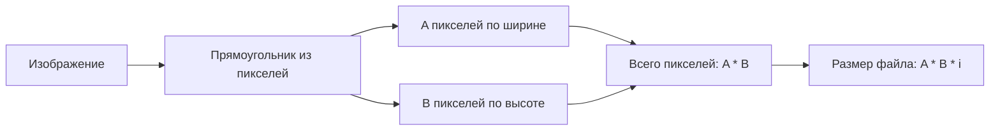
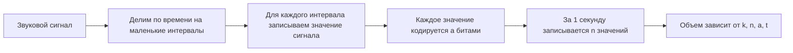

# ТЕОРИЯ

Задание 7 ЕГЭ по информатике посвящено кодированию графической и звуковой информации. В таких задачах обычно нужно найти информационный объем файла, определить количество цветов, восстановить глубину кодирования или вычислить один из параметров записи по известным данным.

Смысл всего номера простой: компьютер хранит любую информацию в двоичном виде. Поэтому и изображение, и звук на экзамене рассматриваются как набор элементов, каждый из которых занимает некоторое количество бит.

**Что нужно уметь**

| Блок | Что обычно спрашивают |
| --- | --- |
| Графика | размер изображения, количество пикселей, количество цветов, глубина цвета |
| Звук | объем записи, время звучания, частота дискретизации, глубина кодирования, число каналов |
| Передача данных | время передачи файла, скорость канала, задержка старта передачи |
| Единицы измерения | перевод бит в байты, Кбайты, Мбайты |

**Кодирование растрового изображения**

В задании 7 рассматривается только **растровая графика**. Растровое изображение состоит из пикселей, то есть маленьких точек, расположенных в виде прямоугольной сетки.



Если изображение имеет размер `A x B` пикселей, то:
- `A * B` — общее количество пикселей;
- каждый пиксель занимает одинаковое количество бит;
- размер изображения равен произведению числа пикселей на размер одного пикселя.

**Основная формула**

```text
размер изображения = A * B * i
```

| Обозначение | Смысл |
| --- | --- |
| `A` | ширина изображения в пикселях |
| `B` | высота изображения в пикселях |
| `i` | информационный объем одного пикселя в битах |

**Что важно про пиксель**

В формуле размера изображения `i` — это **полный размер пикселя**. В него может входить:
- информация о цвете;
- информация о прозрачности;
- дополнительные служебные данные, если это явно указано в условии.

Если задача спрашивает **количество цветов**, то используется не полный размер пикселя, а только та часть, которая кодирует именно цвет.

**Связь между количеством бит и количеством цветов**

Если на кодирование цвета одного пикселя отводится `n` бит, то можно закодировать:

```text
2^n цветов
```

Это одна из главных формул в задании 7.

| Бит на цвет | Максимальное количество цветов |
| --- | --- |
| `1` | `2` |
| `2` | `4` |
| `3` | `8` |
| `4` | `16` |
| `8` | `256` |
| `16` | `65536` |

**Важное различие**

| Если в условии спрашивают... | Нужно использовать... |
| --- | --- |
| размер файла | полный размер пикселя |
| количество цветов | только биты, выделенные на цвет |
| наличие прозрачности | учитывать ее в размере пикселя, но не в количестве цветов |

**Как обычно решают задачи на графику**

1. Находят количество пикселей: `A * B`.
2. Умножают на размер одного пикселя.
3. При необходимости переводят результат из бит в байты.
4. Если речь идет о палитре, отдельно используют формулу `2^n`.

**Типичные ошибки в задачах на графику**

| Ошибка | Что проверить |
| --- | --- |
| перепутаны биты и байты | деление на `8` делается только при переводе в байты |
| в формулу `2^n` подставлен полный размер пикселя | для цветов берутся только биты на цвет |
| забыта прозрачность | если она указана, она увеличивает размер пикселя |
| неверно посчитано число пикселей | размеры изображения перемножаются |

**Кодирование звука**

Звук кодируется иначе. Если изображение состоит из пикселей, то звук представляют как набор значений сигнала, снятых через одинаковые промежутки времени.

Звуковой сигнал непрерывен, но компьютер не может хранить непрерывную величину напрямую. Поэтому звук разбивают на очень маленькие интервалы времени, и для каждого такого интервала записывают значение сигнала.



**Основная формула**

```text
размер звука = k * n * a * t
```

| Обозначение | Смысл |
| --- | --- |
| `k` | количество каналов |
| `n` | частота дискретизации, то есть число значений за 1 секунду |
| `a` | глубина кодирования, то есть число бит на одно значение |
| `t` | время звучания в секундах |

**Как понимать параметры**

| Параметр | Что означает |
| --- | --- |
| частота дискретизации | сколько раз в секунду измеряется сигнал |
| глубина кодирования | сколько бит выделено на одно измерение |
| время звучания | сколько секунд длится запись |
| количество каналов | сколько независимых звуковых потоков записывается |

**Каналы**

| Режим записи | Число каналов |
| --- | --- |
| моно | `1` |
| стерео | `2` |

Если каналов больше, объем файла увеличивается пропорционально, потому что каждый канал кодируется отдельно.

Частота дискретизации часто дана в `кГц`. Перед подстановкой в формулу ее нужно перевести в `Гц`:

```text
1 кГц = 1000 Гц
```

**Как обычно решают задачи на звук**

1. Выписывают известные параметры `k`, `n`, `a`, `t`.
2. Подставляют их в формулу `k * n * a * t`.
3. Если неизвестен один параметр, выражают его из формулы.
4. Следят за единицами времени: минуты и часы переводят в секунды.
5. В конце переводят ответ в нужные единицы измерения.

**Типичные ошибки в задачах на звук**

| Ошибка | Что проверить |
| --- | --- |
| минуты не переведены в секунды | время в формуле должно быть в секундах |
| забыто число каналов | для стерео объем в 2 раза больше, чем для моно |
| перепутаны частота и глубина | `n` — сколько значений в секунду, `a` — сколько бит на одно значение |
| перепутаны биты и байты | перевод в байты выполняется только после вычисления объема в битах |

**Передача данных**

В части задач сначала находят объем файла, а потом по скорости канала определяют время передачи.

Основная формула:

```text
время передачи = объем данных / скорость передачи
```

Здесь важно, чтобы объем и скорость были выражены в согласованных единицах. Если скорость дана в `бит/с`, то и объем нужно переводить в биты.

**Что чаще всего встречается**

| Сюжет | Что делать |
| --- | --- |
| передача одного файла | найти объем файла и разделить на скорость |
| передача изображения | сначала найти размер изображения, потом разделить на скорость |
| передача аудио | сначала найти размер звукового файла, потом разделить на скорость |
| два канала или ретрансляция | проверить, идут ли этапы друг за другом или параллельно |

**Типичные ошибки в задачах на передачу**

| Ошибка | Что проверить |
| --- | --- |
| скорость в битах, объем в байтах | привести все к одним единицам |
| перепутаны секунды и минуты | перевод делать в самом конце |
| времена сложены автоматически | сначала понять, идут процессы последовательно или параллельно |

**Служебные данные и заголовки**

Иногда в задаче кроме самих данных есть служебная информация:
- заголовок файла;
- заголовок каждого трека;
- дополнительные биты на прозрачность;
- биты контроля четности;
- отдельный фиксированный объем на описание файла.

В таких задачах полезно сначала разделить, какой объем относится к содержимому, а какой — к служебной части.

Короткое правило:
- если спрашивают размер изображения или звука, нужно понять, входят ли служебные данные в общий объем;
- если спрашивают количество цветов, нельзя включать в `2^n` биты, которые не кодируют цвет;
- если заголовок есть у каждого объекта, остаток объема нужно делить на число объектов.

**Перевод единиц измерения**

В 7 задании почти всегда важен аккуратный перевод единиц.

| Единица | Соотношение |
| --- | --- |
| `1 байт` | `8 бит` |
| `1 Кбайт` | `1024 байта` |
| `1 Мбайт` | `1024 Кбайта` |
| `1 Гбайт` | `1024 Мбайта` |

Если ответ нужен в байтах, сначала находят объем в битах, а затем делят на `8`.

**Общий алгоритм решения**

| Шаг | Что сделать |
| --- | --- |
| `1` | определить, идет ли речь о графике или о звуке |
| `2` | выписать все известные данные |
| `3` | выбрать нужную формулу |
| `4` | привести единицы к одному виду |
| `5` | выполнить вычисления |
| `6` | перевести ответ в требуемые единицы |
| `7` | проверить, не перепутаны ли биты и байты, а также полный размер пикселя и биты на цвет |

**Короткая шпаргалка**

| Что помнить | Формула или правило |
| --- | --- |
| размер изображения | `A * B * i` |
| количество цветов | `2^n` |
| размер звука | `k * n * a * t` |
| время передачи | `объем / скорость` |
| перевод бит в байты | разделить на `8` |
| прозрачность | влияет на размер пикселя, но не на число цветов |

---

Этот теоретический блок нужен как опора для всех прототипов: сначала определяется, какой объект кодируется, затем выбирается формула, после чего остается аккуратно подставить данные и проверить единицы измерения.

Отдельно стоит помнить о задачах с `dpi` или `ppi`. На реальном экзамене такие задачи почти не встречались, но это старый тип заданий, который теоретически может появиться как усложнение. По сути они несложные: при изменении разрешения сканирования меняется количество точек по каждой стороне, а значит общее число пикселей меняется как квадрат коэффициента.

# РАЗБОР ПРОТОТИПОВ

## Прототип 10. Минимальный объем

**Текст задания**

Какой минимальный объём памяти (в Кбайт) нужно зарезервировать, чтобы можно было сохранить любое растровое изображение размером `128 x 128` пикселей при условии, что в изображении могут использоваться `256` различных цветов? В ответе нужно записать только целое число.

**Идея решения**

Это стандартная задача на объем растрового изображения. Сначала нужно определить, сколько бит требуется для кодирования одного пикселя, а затем умножить это значение на количество пикселей.

Так как используется `256` цветов, на цвет одного пикселя требуется:

```text
2^8 = 256
```

Значит, один пиксель занимает `8` бит.

**Разбор решения**

Размер изображения:

```text
128 * 128 = 16384 пикселя
```

Объём изображения в битах:

```text
16384 * 8 = 131072 бит
```

Переведем в байты:

```text
131072 : 8 = 16384 байта
```

Переведем в Кбайты:

```text
16384 : 1024 = 16 Кбайт
```

Лишних шагов здесь нет. В условии нет прозрачности и нет дополнительных данных на пиксель, поэтому достаточно учесть только `8` бит на цвет.

**Ответ**

`16`

## Прототип 32. Время записи

**Текст задания**

Производилась двухканальная `стерео` звукозапись с частотой дискретизации `64 кГц` и `24`-битным разрешением. В результате был получен файл размером `48 Мбайт`, сжатие данных не производилось. Определите приблизительно, сколько времени в минутах проводилась запись. В качестве ответа укажите ближайшее к времени записи целое число.

**Идея решения**

Здесь известен размер файла, а нужно найти время записи. Значит, используется та же формула для звука, но из нее нужно выразить `t`:

```text
размер звука = k * n * a * t
```

Тогда:

```text
t = размер звука / (k * n * a)
```

**Разбор решения**

Переведем размер файла в биты:

```text
48 * 1024 * 1024 = 50331648 байт
50331648 * 8 = 402653184 бит
```

Теперь выпишем параметры записи:
- `k = 2`, так как запись стерео;
- `n = 64000`, так как `64 кГц = 64000 Гц`;
- `a = 24` бита.

Подставим в формулу:

```text
t = 402653184 / (2 * 64000 * 24)
```

Вычислим:

```text
2 * 64000 * 24 = 3072000
t ≈ 402653184 / 3072000 ≈ 131,07 секунды
```

Переведем в минуты:

```text
131,07 : 60 ≈ 2,18 минуты
```

Ближайшее целое число:

```text
2
```

По сравнению с предыдущими звуковыми прототипами ход здесь обратный: раньше по времени находили размер файла, а здесь по размеру файла восстанавливается время записи.

**Ответ**

`2`

## Прототип 88. Максимальная глубина

**Текст задания**

Производится двухканальная `стерео` звукозапись с частотой дискретизации `44 кГц`. Запись длится `5` минут `25` секунд, её результаты записываются в файл без сжатия данных, причём каждый сигнал кодируется минимально возможным и одинаковым количеством бит. Информационный объём полученного файла без учёта заголовка не превышает `82 Мбайт`. Определите максимальную битовую глубину кодирования звука, которая могла быть использована в этой записи. В ответе укажите только целое число.

**Идея решения**

В этой задаче нужно найти максимальное значение битовой глубины `a`, которое еще укладывается в ограничение по размеру файла.

Используем формулу:

```text
размер звука = k * n * a * t
```

Все параметры, кроме `a`, известны.

**Разбор решения**

Сначала переведем время в секунды:

```text
5 минут 25 секунд = 5 * 60 + 25 = 325 секунд
```

Теперь выпишем известные данные:
- `k = 2`;
- `n = 44000`, так как `44 кГц = 44000 Гц`;
- `t = 325`.

Переведем ограничение по объему в биты:

```text
82 * 1024 * 1024 = 85983232 байта
85983232 * 8 = 687865856 бит
```

Подставим в формулу:

```text
2 * 44000 * a * 325 <= 687865856
```

Упростим:

```text
28600000 * a <= 687865856
```

Найдем максимальное значение `a`:

```text
a <= 687865856 / 28600000 ≈ 24,05
```

Значит, максимально возможная целая битовая глубина:

```text
24
```

Нужно взять именно целую часть: битовая глубина выражается целым числом и не должна выходить за заданное ограничение.

**Ответ**

`24`

## Прототип 44. Сравнение двух записей

**Текст задания**

Музыкальный фрагмент был записан в формате `моно`, оцифрован и сохранён в виде файла без использования сжатия данных. Размер полученного файла — `15 Мбайт`. Затем тот же музыкальный фрагмент был записан повторно в формате `стерео` и оцифрован с разрешением в `3` раза выше и частотой дискретизации в `2` раза меньше, чем в первый раз. Сжатие данных не производилось. Укажите размер файла в Мбайт, полученного при повторной записи.

**Идея решения**

Записывается один и тот же музыкальный фрагмент, значит время записи не меняется. Поэтому здесь удобнее не вычислять абсолютные параметры, а сразу сравнить, как меняется размер файла по формуле:

```text
размер звука = k * n * a * t
```

Меняются три величины:
- число каналов;
- глубина кодирования;
- частота дискретизации.

**Разбор решения**

Сравним первую и вторую запись.

1. Число каналов:

```text
моно -> стерео
```

Значит, размер увеличивается в `2` раза.

2. Разрешение:

```text
во 2-й записи оно в 3 раза выше
```

Значит, глубина кодирования увеличивается в `3` раза.

3. Частота дискретизации:

```text
во 2-й записи она в 2 раза меньше
```

Значит, размер уменьшается в `2` раза.

Общий коэффициент изменения:

```text
2 * 3 / 2 = 3
```

Следовательно, размер второго файла:

```text
15 * 3 = 45 Мбайт
```

Эта задача удобна тем, что здесь не нужно подставлять конкретные значения в формулу. Достаточно сравнить, какие параметры увеличились, какие уменьшились, и перемножить коэффициенты изменения.

**Ответ**

`45`

## Прототип 30. Передача стереофайла

**Текст задания**

Стереоаудиофайл передаётся со скоростью `32000 бит/с`. Файл был записан с такими параметрами: глубина кодирования — `16` бит на отсчёт, частота дискретизации — `48000` отсчётов в секунду, время записи — `90` с. Сколько минут будет передаваться файл?

**Идея решения**

Сначала нужно найти размер звукового файла по формуле

```text
размер звука = k * n * a * t
```

а затем разделить полученный объем на скорость передачи:

```text
время передачи = объем файла / скорость передачи
```

**Разбор решения**

Запись стерео, значит:

```text
k = 2
```

Остальные параметры:
- `n = 48000`;
- `a = 16`;
- `t = 90`.

Найдем объем файла в битах:

```text
2 * 48000 * 16 * 90 = 138240000 бит
```

Теперь найдем время передачи:

```text
138240000 : 32000 = 4320 секунд
```

Переведем в минуты:

```text
4320 : 60 = 72 минуты
```

Схема простая: сначала считается размер файла, потом по скорости передачи находится время.

**Ответ**

`72`

## Прототип 31. Передача изображения

**Текст задания**

Сколько секунд потребуется модему, передающему сообщения со скоростью `28800 бит/с`, чтобы передать растровое изображение размером `800 x 600` пикселей, при условии что в палитре `2^24` цветов?

**Идея решения**

Сначала нужно найти объем изображения. В палитре `2^24` цветов, значит на один пиксель приходится `24` бита. После этого объем изображения делится на скорость передачи.

**Разбор решения**

Определим глубину цвета:

```text
2^24 цветов -> 24 бита на пиксель
```

Найдем количество пикселей:

```text
800 * 600 = 480000 пикселей
```

Тогда объем изображения:

```text
480000 * 24 = 11520000 бит
```

Теперь найдем время передачи:

```text
11520000 : 28800 = 400 секунд
```

В этой задаче, как и в предыдущей, нужно сначала найти информационный объем файла, а потом разделить его на скорость передачи. Отличие только в том, что здесь передается не звук, а изображение.

**Ответ**

`400`

## Прототип 38. Ретрансляция по двум каналам

**Текст задания**

У Толи есть доступ к сети Интернет по высокоскоростному одностороннему радиоканалу, обеспечивающему скорость получения информации `2^19` бит в секунду. У Миши нет скоростного доступа в Интернет, но есть возможность получать информацию от Толи по низкоскоростному телефонному каналу со средней скоростью `2^14` бит в секунду. Миша договорился с Толей, что тот будет скачивать для него данные объёмом `6 Мбайт` по высокоскоростному каналу и ретранслировать их Мише по низкоскоростному каналу. Компьютер Толи может начать ретрансляцию данных не раньше, чем им будут получены первые `256 Кбайт` этих данных. Каков минимально возможный промежуток времени в секундах с момента начала скачивания Толей данных до полного их получения Мишей?

**Идея решения**

Здесь процесс состоит из двух этапов:
- сначала Толя должен скачать первые `256 Кбайт`, чтобы можно было начать ретрансляцию;
- после этого скачивание и передача Мише идут параллельно.

Канал Толи заметно быстрее канала к Мише, поэтому после старта ретрансляции все упирается именно в медленный канал передачи Мише.

**Разбор решения**

Сначала найдем время, за которое Толя получит первые `256 Кбайт`.

Переведем этот объем в биты:

```text
256 Кбайт = 256 * 1024 байт = 262144 байта
262144 * 8 = 2097152 бита
```

Скорость скачивания Толи:

```text
2^19 = 524288 бит/с
```

Тогда время ожидания до старта ретрансляции:

```text
2097152 : 524288 = 4 с
```

Теперь найдем, сколько времени Мише нужно для получения всех `6 Мбайт`.

Переведем объем в биты:

```text
6 Мбайт = 6 * 1024 * 1024 байта = 6291456 байт
6291456 * 8 = 50331648 бит
```

Скорость передачи Мише:

```text
2^14 = 16384 бит/с
```

Время передачи всего объема Мише:

```text
50331648 : 16384 = 3072 с
```

Осталось понять, как здесь складывается общее время.

Первые `4` секунды Толя только накапливает начальные `256 Кбайт`. После этого начинается передача Мише, и именно она занимает `3072` секунды. Скачивание у Толи идет быстрее и не тормозит процесс дальше.

Поэтому общее минимальное время:

```text
4 + 3072 = 3076 с
```

Просто сложить полное время скачивания у Толи и полное время передачи Мише нельзя. После получения первых `256 Кбайт` процессы идут одновременно, поэтому отдельно добавляется только начальная задержка.

**Ответ**

`3076`

## Прототип 39. Заголовки треков

**Текст задания**

Маша скачивает из Интернета альбом любимой музыкальной группы, оцифрованный в формате `стерео` с частотой дискретизации `20000 Гц` и разрешением `32` бита без использования сжатия. В альбоме `13` треков общей длительностью `35` минут `50` секунд. Каков максимально возможный объём заголовка трека в Кбайт, если известно, что общий объём альбома не превышает `339 Мбайт`? В ответе запишите целое число.

**Идея решения**

Сначала нужно найти объем всех аудиоданных без заголовков. После этого из общего допустимого объема альбома вычитается объем самого звука. Оставшийся объем можно потратить на заголовки всех `13` треков.

**Разбор решения**

Сначала переведем общую длительность в секунды:

```text
35 минут 50 секунд = 35 * 60 + 50 = 2150 секунд
```

Найдем объем всех звуковых данных по формуле:

```text
размер звука = k * n * a * t
```

Здесь:
- `k = 2`, так как запись стерео;
- `n = 20000`;
- `a = 32`;
- `t = 2150`.

Подставим:

```text
2 * 20000 * 32 * 2150 = 2752000000 бит
```

Переведем в байты:

```text
2752000000 : 8 = 344000000 байт
```

Теперь найдем максимально допустимый объем всего альбома в байтах:

```text
339 Мбайт = 339 * 1024 * 1024 = 355467264 байта
```

Тогда суммарный объем всех заголовков не может превышать:

```text
355467264 - 344000000 = 11467264 байта
```

Разделим этот объем на `13` треков:

```text
11467264 : 13 ≈ 882097,23 байта
```

Переведем в Кбайты:

```text
882097,23 : 1024 ≈ 861,42 Кбайт
```

Нужен максимально возможный целый объем заголовка одного трека, значит, берем целую часть:

```text
861
```

Остаток нужно делить именно на количество треков, потому что заголовок есть у каждого трека.

**Ответ**

`861`

## Прототип 11. Цвета по объему

**Текст задания**

Рисунок размером `128 x 256` пикселей занимает в памяти `24 Кбайт` без учета сжатия. Найдите максимально возможное количество цветов в палитре изображения.

**Идея решения**

В отличие от предыдущего прототипа, здесь известен общий объем файла, а нужно найти, сколько бит приходится на один пиксель. После этого используется формула `2^n`, где `n` — число бит на цвет.

**Разбор решения**

Сначала находим количество пикселей:

```text
128 * 256 = 32768 пикселей
```

Переведем `24 Кбайт` в биты:

```text
24 * 1024 * 8 = 196608 бит
```

Теперь найдем, сколько бит приходится на один пиксель:

```text
196608 : 32768 = 6 бит
```

Значит, на кодирование цвета одного пикселя выделено `6` бит. Тогда максимально возможное количество цветов равно:

```text
2^6 = 64
```

Ход тот же, что и в предыдущем прототипе: используется связь между размером изображения, числом пикселей и количеством бит на пиксель. Разница в том, что здесь задача обратная: не по числу цветов ищется объем, а по объему восстанавливается число цветов.

**Ответ**

`64`

## Прототип 38. Цвета по памяти

**Текст задания**

Камера делает фотоснимки размером `1600 x 1200` пикселей. На хранение одного кадра отводится `1 Мбайт`. Найдите максимально возможное количество цветов в палитре изображения.

**Идея решения**

Здесь известны размеры изображения и общий объем памяти на один кадр. Нужно определить, сколько бит может приходиться на один пиксель, а затем по формуле `2^n` найти максимально возможное число цветов.

**Разбор решения**

Сначала находим количество пикселей:

```text
1600 * 1200 = 1920000 пикселей
```

Переведем `1 Мбайт` в биты:

```text
1 Мбайт = 1024 * 1024 байта = 1048576 байт
1048576 * 8 = 8388608 бит
```

Теперь найдем, сколько бит приходится на один пиксель:

```text
8388608 : 1920000 ≈ 4,36
```

Количество бит на пиксель должно быть целым числом, поэтому можно взять только `4` бита на пиксель. `5` бит уже не поместятся в отведенный объем памяти.

Тогда максимально возможное количество цветов:

```text
2^4 = 16
```

`4,36` нельзя просто "округлить по привычке". На один пиксель можно выделить только целое число бит, и оно не должно превышать найденное значение. Поэтому берется целая часть.

**Ответ**

`16`

## Прототип 39. Лимит на файл

**Текст задания**

Камера делает фотоснимки `768 x 600` пикселей. При этом объём файла с изображением не может превышать `420 Кбайт`, упаковка данных не производится. Какое максимальное количество цветов можно использовать в палитре изображения?

**Идея решения**

Это та же схема, что и в предыдущем прототипе: по известному объему файла нужно найти максимально допустимое число бит на пиксель. Отличие в том, что здесь дано ограничение "не может превышать", поэтому нужно выбрать наибольшее целое значение, которое еще укладывается в лимит.

**Разбор решения**

Сначала находим количество пикселей:

```text
768 * 600 = 460800 пикселей
```

Переведем `420 Кбайт` в биты:

```text
420 * 1024 = 430080 байт
430080 * 8 = 3440640 бит
```

Найдем максимально возможное число бит на один пиксель:

```text
3440640 : 460800 ≈ 7,46
```

Значит, можно взять не более `7` бит на пиксель. `8` бит уже дадут слишком большой объем файла.

Теперь найдем максимальное количество цветов:

```text
2^7 = 128
```

Ход такой же, как в прототипе 38: сначала находится допустимое количество бит на пиксель, затем по нему вычисляется число цветов. Отличие только в числах и в том, что здесь нужно взять наибольшее целое значение, которое не превышает ограничение.

**Ответ**

`128`

## Прототип 103. Сжатие на 15%

**Текст задания**

Для хранения произвольного растрового изображения размером `486 x 720` пикселей отведено `80 Кбайт` памяти без учёта размера заголовка файла. Для кодирования цвета каждого пикселя используется одинаковое количество бит, коды пикселей записываются в файл один за другим без промежутков. При сохранении данные сжимаются, размер итогового файла после сжатия становится на `15%` меньше исходного. Какое максимальное количество цветов можно использовать в изображении?

**Идея решения**

Здесь в памяти отведено `80 Кбайт` уже для итогового, то есть сжатого файла. Значит, сначала нужно восстановить размер исходного файла до сжатия, а потом найти, сколько бит приходится на один пиксель.

Ключевая мысль: если сказано, что файл **стал на 15% меньше исходного**, то за `100%` принимается именно исходный файл. После сжатия осталось `85%` исходного объема.

**Разбор решения**

Сначала находим размер исходного файла.

Сжатый файл составляет `85%` исходного:

```text
85% = 80 Кбайт
100% = x Кбайт
```

Составим пропорцию:

```text
x = 80 * 100 / 85 = 1600 / 17 ≈ 94,12 Кбайт
```

Количество бит на пиксель должно быть целым, поэтому удобно сразу перейти к битам и проверить, какое значение подходит.

Найдем количество пикселей:

```text
486 * 720 = 349920 пикселей
```

Сравним возможные значения.

Если взять `2` бита на пиксель, то исходный размер будет:

```text
349920 * 2 = 699840 бит
699840 : 8 = 87480 байт
87480 : 1024 ≈ 85,43 Кбайт
```

После сжатия такой файл уменьшится на `15%`, то есть останется `85%`:

```text
85,43 * 0,85 ≈ 72,6 Кбайт
```

Это меньше `80 Кбайт`, значит, `2` бита подходят.

Если взять `3` бита на пиксель, то исходный размер будет:

```text
349920 * 3 = 1049760 бит
1049760 : 8 = 131220 байт
131220 : 1024 ≈ 128,14 Кбайт
```

После сжатия получим:

```text
128,14 * 0,85 ≈ 108,9 Кбайт
```

Это уже больше `80 Кбайт`, значит, `3` бита не подходят.

Следовательно, максимально можно использовать `2` бита на пиксель. Тогда число цветов равно:

```text
2^2 = 4
```

**Ответ**

`4`

## Прототип 111. Сжатый и исходный

**Текст задания**

Для хранения сжатого произвольного растрового изображения размером `640 x 256` пикселей отведено `170 Кбайт` памяти без учёта размера заголовка файла. Исходный файл изображения больше, чем сжатый, на `35%`. Для кодирования цвета каждого пикселя используется одинаковое количество бит, коды пикселей записываются в файл один за другим без промежутков. Какое максимальное количество цветов можно использовать в изображении?

**Идея решения**

Здесь `170 Кбайт` — это размер уже сжатого файла. Но в условии сказано иначе: **исходный файл больше, чем сжатый, на 35%**. Значит, за `100%` нужно брать именно сжатый файл, потому что сравнение идет с ним.

Тогда исходный файл составляет `135%` от сжатого.

**Разбор решения**

Найдем размер исходного файла:

```text
100% = 170 Кбайт
135% = x Кбайт
```

Тогда:

```text
x = 170 * 135 / 100 = 229,5 Кбайт
```

Теперь найдем количество пикселей:

```text
640 * 256 = 163840 пикселей
```

Переведем исходный размер в биты:

```text
229,5 * 1024 = 235008 байт
235008 * 8 = 1880064 бит
```

Найдем, сколько бит приходится на один пиксель:

```text
1880064 : 163840 ≈ 11,47
```

Значит, можно взять не более `11` бит на пиксель. `12` бит уже не поместятся.

Теперь найдем максимальное количество цветов:

```text
2^11 = 2048
```

По структуре это та же обратная задача, что и раньше, но добавляется шаг с восстановлением исходного объема до сжатия. Главное отличие между этим прототипом и предыдущим в том, от какого файла считается процент.

**Ответ**

`2048`

## Прототип 114. Биты на прозрачность

**Текст задания**

Для хранения произвольного растрового изображения размером `1024 x 120` пикселей отведено `150 Кбайт` памяти без учёта размера заголовка файла. При кодировании каждого пикселя используется `5` бит для определения степени прозрачности и одинаковое количество бит для указания его цвета. Коды пикселей записываются в файл один за другим без промежутков. Какое максимальное количество цветов без учёта степени прозрачности можно использовать в изображении?

**Идея решения**

Здесь нужно сразу разделить две части кодирования пикселя:
- `5` бит уходят на прозрачность;
- еще несколько бит уходят на цвет.

Нужно сначала найти общий размер одного пикселя, а затем вычесть из него `5` бит на прозрачность. Только оставшиеся биты участвуют в вычислении количества цветов.

**Разбор решения**

Сначала находим количество пикселей:

```text
1024 * 120 = 122880 пикселей
```

Переведем объем файла в биты:

```text
150 * 1024 = 153600 байт
153600 * 8 = 1228800 бит
```

Теперь найдем, сколько бит приходится на один пиксель:

```text
1228800 : 122880 = 10 бит
```

Из этих `10` бит:
- `5` бит идут на прозрачность;
- значит, на цвет остается `5` бит.

Тогда максимально возможное количество цветов равно:

```text
2^5 = 32
```

Ловушка в этой задаче простая: в формулу `2^n` нельзя подставлять все `10` бит, потому что часть из них не кодирует цвет, а отвечает за степень прозрачности.

**Ответ**

`32`

## Прототип 117. Бит четности

**Текст задания**

Для хранения произвольного растрового изображения размером `480 x 768` пикселей отведено `675 Кбайт` памяти без учёта размера заголовка файла. При кодировании цвета каждого пикселя используется одинаковое количество бит, при этом для каждых четырёх бит цвета дописывается дополнительный бит контроля чётности. Коды пикселей записываются в файл один за другим без промежутков. Какое максимальное количество цветов можно использовать в изображении?

**Идея решения**

В этой задаче не весь размер пикселя кодирует цвет. Часть бит — служебные: после каждых `4` бит цвета добавляется `1` бит контроля чётности.

Поэтому нужно:
1. найти общий размер одного пикселя;
2. подобрать, сколько из этих бит могут быть именно цветовыми, если на каждые `4` цветовых бита добавляется `1` служебный.

**Разбор решения**

Сначала находим количество пикселей:

```text
480 * 768 = 368640 пикселей
```

Переведем `675 Кбайт` в биты:

```text
675 * 1024 = 691200 байт
691200 * 8 = 5529600 бит
```

Найдем общий размер одного пикселя:

```text
5529600 : 368640 = 15 бит
```

Теперь разберем структуру этих `15` бит. На каждые `4` бита цвета добавляется `1` бит контроля. Значит:

```text
4 бита цвета + 1 бит контроля = 5 бит
```

Всего на пиксель отводится `15` бит, то есть:

```text
15 : 5 = 3 таких группы
```

В каждой группе `4` бита — это цвет. Тогда всего на цвет приходится:

```text
3 * 4 = 12 бит
```

Следовательно, максимально возможное количество цветов:

```text
2^12 = 4096
```

В отличие от предыдущего прототипа, здесь число служебных бит не задано сразу. Его нужно восстановить из правила: на каждые `4` цветовых бита добавляется `1` дополнительный бит.

**Ответ**

`4096`

## Прототип 63. Снимки за сутки

**Текст задания**

Автоматическая фотокамера каждые `6` с создаёт черно-белое растровое изображение, содержащее `256` оттенков. Размер изображения — `128 x 256` пикселей. Все полученные изображения и коды пикселей внутри одного изображения записываются подряд, никакая дополнительная информация не сохраняется, данные не сжимаются. Сколько Мбайтов нужно выделить для хранения всех изображений, полученных за сутки?

**Идея решения**

Здесь тоже два шага:
1. найти объем одного изображения;
2. определить, сколько таких изображений будет получено за сутки, и умножить.

Изображение содержит `256` оттенков, значит на один пиксель требуется `8` бит:

```text
2^8 = 256
```

**Разбор решения**

Сначала находим количество пикселей в одном изображении:

```text
128 * 256 = 32768 пикселей
```

Объем одного изображения в битах:

```text
32768 * 8 = 262144 бит
```

Переведем в байты:

```text
262144 : 8 = 32768 байт
```

Переведем в Кбайты:

```text
32768 : 1024 = 32 Кбайт
```

Теперь найдем, сколько изображений камера делает за сутки.

В сутках:

```text
24 * 60 * 60 = 86400 секунд
```

Снимок делается каждые `6` секунд, значит всего получится:

```text
86400 : 6 = 14400 изображений
```

Тогда общий объем:

```text
14400 * 32 = 460800 Кбайт
```

Переведем в Мбайты:

```text
460800 : 1024 = 450 Мбайт
```

Здесь к расчету объема одного файла добавляется еще один шаг: нужно учесть количество одинаковых файлов за фиксированное время.

**Ответ**

`450`

## Прототип 80. Сжатие и служебные данные

**Текст задания**

В информационной системе хранятся изображения размером `1600 x 1200` пикселей. При кодировании используется алгоритм сжатия изображений, позволяющий уменьшить размер памяти для хранения одного изображения в среднем в `5` раз по сравнению с независимым кодированием каждого пикселя. Каждое изображение дополняется служебной информацией, которая занимает `100 Кбайт`. Для хранения `32` изображений выделено `10 Мбайт` памяти. Какое максимальное количество цветов можно использовать в палитре каждого изображения?

**Идея решения**

Здесь в общий объем памяти входят сразу три части:
- сжатые данные изображения;
- служебная информация;
- количество изображений.

Поэтому удобно идти в таком порядке:
1. найти, сколько памяти приходится на одно изображение вместе со служебной информацией;
2. вычесть `100 Кбайт` служебных данных;
3. восстановить исходный размер изображения до сжатия, так как файл уменьшен в `5` раз;
4. найти число бит на пиксель и по нему определить количество цветов.

**Разбор решения**

Сначала найдем общий объем памяти в Кбайтах:

```text
10 Мбайт = 10 * 1024 = 10240 Кбайт
```

На одно изображение приходится:

```text
10240 : 32 = 320 Кбайт
```

Из них `100 Кбайт` занимает служебная информация, значит, на сжатые данные самого изображения остается:

```text
320 - 100 = 220 Кбайт
```

По условию сжатие уменьшает размер изображения в `5` раз. Значит, исходный размер изображения без сжатия равен:

```text
220 * 5 = 1100 Кбайт
```

Теперь найдем количество пикселей:

```text
1600 * 1200 = 1920000 пикселей
```

Переведем исходный размер изображения в биты:

```text
1100 * 1024 = 1126400 байт
1126400 * 8 = 9011200 бит
```

Найдем, сколько бит приходится на один пиксель:

```text
9011200 : 1920000 ≈ 4,69
```

Значит, можно взять не более `4` бит на пиксель. `5` бит уже не поместятся.

Тогда максимально возможное количество цветов:

```text
2^4 = 16
```

Сложность здесь только в порядке действий. Нельзя сразу делить весь объем памяти на число пикселей: сначала нужно учесть количество изображений, потом убрать служебную информацию, и только после этого восстановить исходный объем до сжатия.

**Ответ**

`16`

## Прототип 44. Смена палитры

**Текст задания**

Автоматическая фотокамера делает фотографии высокого разрешения с палитрой, содержащей `2^24 = 16777216` цветов. Средний размер фотографии составляет `12 Мбайт`. Для хранения в базе данных фотографии преобразуют в формат с палитрой, содержащей `2^16 = 65536` цветов. Другие преобразования и дополнительные методы сжатия не используются. Сколько Мбайт составляет средний размер преобразованной фотографии?

**Идея решения**

Размер изображения пропорционален количеству бит на один пиксель. Если размеры фотографии в пикселях не меняются и никакого дополнительного сжатия нет, то достаточно сравнить, сколько бит на цвет было сначала и сколько стало после преобразования.

Изначально:

```text
2^24 цветов -> 24 бита на цвет
```

После преобразования:

```text
2^16 цветов -> 16 бит на цвет
```

Значит, размер файла уменьшится в отношении `16 : 24`, то есть в `2 : 3`.

**Разбор решения**

Так как:
- размеры изображения не изменяются;
- другие преобразования не используются;
- дополнительного сжатия нет,

то меняется только количество бит, которое нужно для кодирования цвета одного пикселя.

Было `24` бита на пиксель, стало `16` бит на пиксель. Тогда новый размер файла:

```text
12 * 16 / 24 = 12 * 2 / 3 = 8 Мбайт
```

Эту задачу можно решать без поиска числа пикселей, потому что оно одинаково до и после преобразования и поэтому сокращается. Достаточно сравнить старую и новую глубину цвета.

**Ответ**

`8`

## Прототип 53. DPI и палитра

**Текст задания**

Для хранения в информационной системе документы сканируются с разрешением `600 ppi` и цветовой системой, содержащей `2^24 = 16777216` цветов. Методы сжатия изображений не используются. Средний размер отсканированного документа составляет `12 Мбайт`. В целях экономии было решено перейти на разрешение `300 ppi` и цветовую систему, содержащую `256` цветов. Сколько Мбайт будет составлять средний размер документа, отсканированного с изменёнными параметрами?

**Идея решения**

В этой задаче меняются сразу два параметра:
- разрешение сканирования;
- глубина цвета.

Если разрешение уменьшается с `600 ppi` до `300 ppi`, то количество точек по каждой стороне уменьшается в `2` раза. Тогда общее число пикселей уменьшается в `2^2 = 4` раза.

Кроме того, цветовая система меняется:

```text
2^24 цветов -> 24 бита на пиксель
256 цветов = 2^8 -> 8 бит на пиксель
```

Значит, глубина цвета уменьшается в `24 : 8 = 3` раза.

Итоговый размер уменьшится в `4 * 3 = 12` раз.

**Разбор решения**

Сравним старые и новые параметры.

1. Разрешение:

```text
600 ppi -> 300 ppi
```

Это уменьшение в `2` раза по ширине и в `2` раза по высоте, значит число пикселей уменьшается в:

```text
2 * 2 = 4 раза
```

2. Цветовая система:

```text
2^24 цветов -> 24 бита
2^8 цветов -> 8 бит
```

Значит, объем на один пиксель уменьшается в:

```text
24 : 8 = 3 раза
```

Тогда новый размер документа:

```text
12 : (4 * 3) = 12 : 12 = 1 Мбайт
```

В задачах такого типа коэффициент по `ppi` нужно учитывать по двум измерениям, а не только по одному.

**Ответ**

`1`

## Прототип 54. Обратный DPI

**Текст задания**

Для хранения в информационной системе документы сканируются с разрешением `600 ppi` и цветовой системой, содержащей `2^24 = 16777216` цветов. Методы сжатия изображений не используются. В целях экономии было решено перейти на разрешение `150 ppi` и цветовую систему, содержащую `2^16 = 65536` цветов. Средний размер документа, отсканированного с изменёнными параметрами, составляет `256 Кбайт`. Сколько Мбайт составлял документ до оптимизации?

**Идея решения**

По сравнению с предыдущим прототипом это обратная задача: здесь известен новый размер, а нужно восстановить старый.

Нужно определить, во сколько раз уменьшился файл после изменения:
- разрешения;
- глубины цвета.

Потом новый размер умножается на этот коэффициент.

**Разбор решения**

Сначала разберем изменение разрешения:

```text
600 ppi -> 150 ppi
```

По каждой стороне разрешение уменьшилось в:

```text
600 : 150 = 4 раза
```

Значит, число пикселей уменьшилось в:

```text
4 * 4 = 16 раз
```

Теперь разберем изменение цветовой системы:

```text
2^24 цветов -> 24 бита
2^16 цветов -> 16 бит
```

Значит, объем на один пиксель уменьшился в:

```text
24 : 16 = 3 : 2
```

То есть новый файл по глубине цвета стал в `1,5` раза меньше старого.

Общий коэффициент уменьшения:

```text
16 * 24 / 16 = 24
```

Можно рассуждать и сразу так:
- пикселей стало в `16` раз меньше;
- бит на пиксель стало в `24 / 16` раза меньше;
- значит, общий размер уменьшился в `16 * 24 / 16 = 24` раза.

Теперь восстановим исходный размер:

```text
256 Кбайт * 24 = 6144 Кбайт
6144 : 1024 = 6 Мбайт
```

В этом прототипе нужно не уменьшать исходный размер, а восстановить его по новому размеру и общему коэффициенту изменения.

**Ответ**

`6`

## Прототип 2. Моно без сжатия

**Текст задания**

Производится одноканальная `моно` звукозапись с частотой дискретизации `22 кГц` и глубиной кодирования `16` бит. Запись длится `2` минуты, её результаты записываются в файл, сжатие данных не производится. Какова целая часть размера полученного файла, выраженная в мегабайтах?

**Идея решения**

Это базовая задача на применение формулы размера звукового файла:

```text
размер звука = k * n * a * t
```

Здесь:
- `k = 1`, потому что запись одноканальная, то есть моно;
- `n = 22000`, так как `22 кГц = 22000 Гц`;
- `a = 16` бит;
- `t = 2 минуты = 120 секунд`.

**Разбор решения**

Подставим данные в формулу:

```text
1 * 22000 * 16 * 120 = 42240000 бит
```

Переведем в байты:

```text
42240000 : 8 = 5280000 байт
```

Переведем в мегабайты:

```text
5280000 : 1024 : 1024 ≈ 5,04 Мбайт
```

Нужно указать целую часть числа, значит, ответ:

```text
5
```

Здесь важны два перевода: `кГц` в `Гц` и минуты в секунды.

**Ответ**

`5`

## Прототип 3. Стерео без сжатия

**Текст задания**

Производится двухканальная `стерео` звукозапись с частотой дискретизации `48 кГц` и глубиной кодирования `24` бита. Запись длится `1` минуту, её результаты записываются в файл, сжатие данных не производится. Какова целая часть размера полученного файла, выраженная в мегабайтах?

**Идея решения**

Ход такой же, как в предыдущем прототипе, но теперь нужно учесть, что запись двухканальная. Значит, `k = 2`.

Используем ту же формулу:

```text
размер звука = k * n * a * t
```

**Разбор решения**

Переведем данные в нужный вид:
- `k = 2`;
- `n = 48000`, так как `48 кГц = 48000 Гц`;
- `a = 24` бита;
- `t = 60` секунд.

Подставим в формулу:

```text
2 * 48000 * 24 * 60 = 138240000 бит
```

Переведем в байты:

```text
138240000 : 8 = 17280000 байт
```

Переведем в мегабайты:

```text
17280000 : 1024 : 1024 ≈ 16,48 Мбайт
```

Берем целую часть:

```text
16
```

Отличие от предыдущего прототипа только в одном: здесь запись стерео, поэтому объем файла сразу увеличивается в `2` раза по сравнению с моно при тех же остальных параметрах.

**Ответ**

`16`
